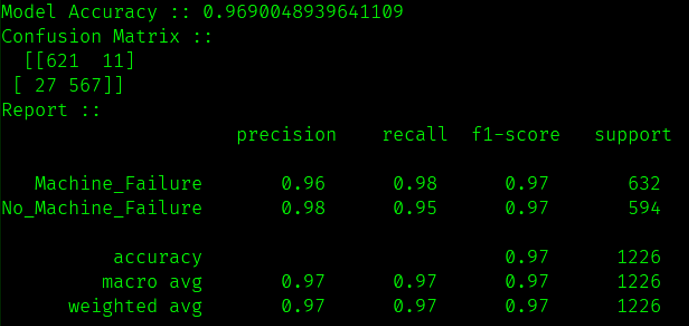

# Machine Downtime Prediction using Machine Learning

## Libraries Used :

#### Scikit-Learn
#### Pandas
#### Flask
#### Numpy

## Model Metrics :

## How to Run :
Clone the repo & run below commands -  
After uploading Machine Downtime.csv file refer the values from it for testing .Some values are also displayed in the terminal .

### Windows :	
	py app.py

### Linux / Mac :
	python3 app.py
